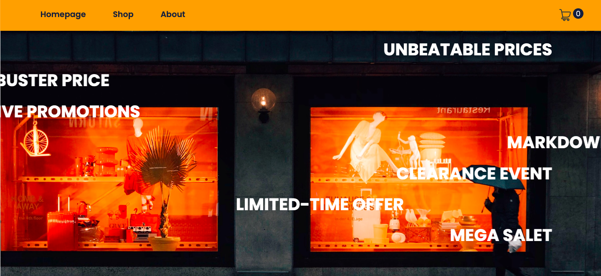

# mock_shopping-cart.

## [Demo](https://bbm2910.github.io/buy_box)
## Components and Functionalities
* Navigation: A navigation bar component is displayed on both the home and shop pages, allowing users to navigate between them.
* ProductCard: An individual card element representing each product, displaying product information, an input field for quantity, and buttons for incrementing/decrementing quantity and adding the product to the cart.
* Home Page: Displays introductory information.
* Shop Page: Displays a list of products fetched from the FakeStore API, each represented by a ProductCard component.
* Product Details Modal:  Users can adjust and add products to their cart from this page.
* Shopping Cart: Displays the number of items in the cart on the navigation bar. Users can view their cart contents, and proceed to checkout.

## Usage
* Clone the repository.
* Navigate to the project directory.
* Install dependencies with npm install.
* Run the development server with npm start.
* Access the application.

## Testing
* Unit tests are written using Vitest (as test runner) and React Testing Library.
* Tests cover components and functionalities, ensuring proper behavior and user interaction.

  ## Compatibility and Requirements

### Web Compatibility
This project is designed to be fully functional and optimized for desktop and web browsers. 

### Mobile Devices
Please note that this project is **not optimized for mobile devices**. The user interface and user experience may not be suitable for mobile viewports, and certain features or layouts may not function as intended on smaller screens.

### Requirements
- A modern web browser (e.g., Chrome, Firefox, Safari, Edge) with a desktop or laptop display.
- Recommended screen width: 1024px or greater.

### Known Issues on Mobile
- The layout may be distorted or unusable on mobile devices.
- Certain interactive elements or features might not be accessible or may not work properly on smaller screens.

If mobile support is required, additional development and testing will be necessary to ensure a responsive design and a seamless experience across all device types.

